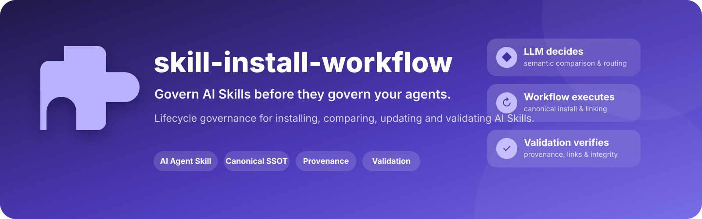
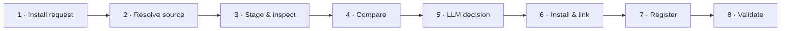
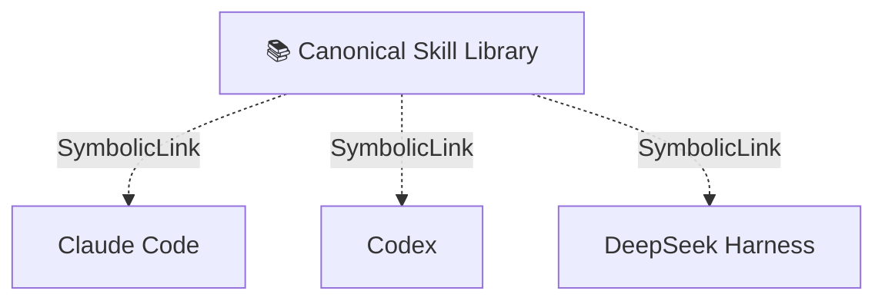

<p align="center">
  
</p>

<div align="center">

[](#)
[](#)
[](#)
[](#)
[](#)

**English** · [简体中文](./README.zh-CN.md)

</div>

---

## 📌 Overview

As local AI Agent ecosystems grow, the same Skill can easily be installed several times, drift into different versions, lose its GitHub provenance, or overlap with another Skill under a different name.

`skill-install-workflow` turns Skill installation into a governed lifecycle:

> **identify → compare → decide → install → link → register → validate**

The goal is not to maximize the number of Skills. The goal is to keep the Skill ecosystem **clean, traceable, maintainable and reproducible**.

## 📦 Installation

`skill-install-workflow` is an AI Agent Skill. You can install it directly into the Skill directory used by your Agent, even if you do not use CC Switch.

### Option A — direct installation without CC Switch

Choose the Agent you actually use. The examples below use the common user-level Skill directories.

#### Claude Code

**macOS / Linux**

```bash
mkdir -p ~/.claude/skills
git clone https://github.com/apexpeng/skill-install-workflow.git \
  ~/.claude/skills/skill-install-workflow
```

**Windows PowerShell**

```powershell
$target = Join-Path $HOME ".claude/skills/skill-install-workflow"
New-Item -ItemType Directory -Force (Split-Path $target -Parent) | Out-Null
git clone https://github.com/apexpeng/skill-install-workflow.git $target
```

#### OpenAI Codex

**macOS / Linux**

```bash
mkdir -p ~/.codex/skills
git clone https://github.com/apexpeng/skill-install-workflow.git \
  ~/.codex/skills/skill-install-workflow
```

**Windows PowerShell**

```powershell
$target = Join-Path $HOME ".codex/skills/skill-install-workflow"
New-Item -ItemType Directory -Force (Split-Path $target -Parent) | Out-Null
git clone https://github.com/apexpeng/skill-install-workflow.git $target
```

#### DeepSeek Harness / shared Agent Skill directory

**macOS / Linux**

```bash
mkdir -p ~/.agents/skills
git clone https://github.com/apexpeng/skill-install-workflow.git \
  ~/.agents/skills/skill-install-workflow
```

**Windows PowerShell**

```powershell
$target = Join-Path $HOME ".agents/skills/skill-install-workflow"
New-Item -ItemType Directory -Force (Split-Path $target -Parent) | Out-Null
git clone https://github.com/apexpeng/skill-install-workflow.git $target
```

> If your Agent uses a custom Skill directory, install the repository into that configured directory instead.

### Option B — recommended for multi-Agent environments: manage Skills with CC Switch

Direct installation is perfectly valid for a single Agent. If you use **multiple Agents on the same machine**, however, maintaining one physical copy per Agent quickly creates duplicate versions and update drift.

For that use case, this project recommends **CC Switch as the centralized Skill-management layer**:

```text
GitHub Skill
    ↓
CC Switch managed storage
~/.cc-switch/skills/<skill>
    ↓
per-Skill SymbolicLink
    ├── ~/.claude/skills/<skill>
    ├── ~/.codex/skills/<skill>
    └── ~/.agents/skills/<skill>
```

Recommended CC Switch settings:

```text
Skills storage: CC Switch
Sync method: SymbolicLink
```

This keeps:

```text
one canonical Skill entity
+ one provenance record
+ multiple Agent consumers
```

instead of several independent physical copies.

Import this Skill into CC Switch with the Deep Link:

**Windows PowerShell**

```powershell
Start-Process "ccswitch://v1/import?resource=skill&name=skill-install-workflow&repo=apexpeng/skill-install-workflow&branch=main"
```

**macOS**

```bash
open "ccswitch://v1/import?resource=skill&name=skill-install-workflow&repo=apexpeng/skill-install-workflow&branch=main"
```

Or open this URI directly:

```text
ccswitch://v1/import?resource=skill&name=skill-install-workflow&repo=apexpeng/skill-install-workflow&branch=main
```

After import, open **CC Switch → Skills**, choose the Agent consumers that should use the Skill, and keep **SymbolicLink** as the synchronization method.

> CC Switch is recommended for centralized multi-Agent management; it is **not a prerequisite for installing ordinary Skills**.

### Recommended installation order for this Skill suite

If you plan to use all three repositories together, install them in this order:

```text
1. skill-install-workflow
        ↓
2. r-data-lineage-plotting
        ↓
3. write-human-r-code
```

Why this order?

1. **`skill-install-workflow` first** — establishes the governance layer for evaluating, installing, updating, deduplicating and validating later Skills.
2. **`r-data-lineage-plotting` second** — establishes data-lineage, directory-role and reproducibility rules for scientific R projects.
3. **`write-human-r-code` third** — adds human-readable R coding and refactoring rules on top of the lineage foundation, and explicitly pairs with `r-data-lineage-plotting` when data files or analysis objects are involved.

## 🔄 Workflow



### Three-layer responsibility

| Layer | Responsibility |
|---|---|
| 🧠 **LLM** | Understand purpose, version differences, overlap and risk |
| ⚙️ **Workflow / scripts** | Perform deterministic installation, linking and metadata operations |
| ✅ **Validation** | Verify canonical source, hashes, links and provenance |

## 🧭 Decision model

| Decision | Meaning |
|---|---|
| 🟢 `INSTALL_NEW` | Install a genuinely new Skill |
| 🔴 `DO_NOT_INSTALL` | Existing capability already covers it |
| 🔵 `UPDATE_EXISTING` | Candidate is a better version of an existing Skill |
| 🟣 `MERGE_INTO_EXISTING` | Absorb useful capabilities without creating a duplicate |
| 🟡 `KEEP_SEPARATE` | Similar domain, but different responsibility |
| ⛔ `REJECT_INVALID` | Incomplete or malformed Skill |
| 🛡️ `REJECT_HIGH_RISK` | Risk exceeds the accepted boundary |
| 🔎 `SOURCE_VERIFICATION_REQUIRED` | Upstream provenance is uncertain |

## 🔬 What gets compared?

The workflow does **not** rely only on folder names, hashes or timestamps.

It evaluates:

```text
purpose
trigger
workflow
inputs / outputs
tools
permissions
safety boundaries
scripts / references
upstream provenance
local modifications
```

and distinguishes:


## 🏗 Recommended architecture



Instead of maintaining several physical copies, the target is:

```text
one Skill
+ one canonical source
+ one provenance record
+ multiple Agent consumers
```

## 🧾 Provenance tracking

A GitHub-hosted Skill should remain traceable:

```yaml
name: example-skill
repository: owner/repository
branch: main
skill_subpath: skills/example-skill
installed_commit: abc123
content_hash: ...
local_modified: false
```

This makes update checks, rollback and auditing reproducible.

## 🛡 Safety & approval gate

A user request such as “install this Skill” is enough authorization for a **new, independent, low-risk** Skill.

The workflow stops for explicit approval when an operation would:

- replace an existing canonical Skill;
- merge two Skills;
- overwrite local modifications;
- install a high-risk Skill;
- depend on an unverified upstream source.

## 💬 Intended interaction

```text
User:
Install this Skill:
https://github.com/example/example-skill

Agent:
Decision: UPDATE_EXISTING

Existing:  example-skill @ abc123
Candidate: example-skill @ def456

Why:
- more precise trigger
- existing safety boundary retained
- no local modifications detected

Approval required because this replaces the canonical version.
```

## ✨ Key features

- 🔁 Exact-duplicate detection
- 🧬 Version-aware comparison
- 🧠 Semantic functional-overlap analysis
- 🛡 Risk-aware installation gate
- 🔗 Symbolic-link friendly multi-Agent sharing
- 🧾 Git provenance tracking
- ✅ Post-install integrity validation

## 🤝 Designed for

Claude Code · OpenAI Codex · DeepSeek Harness · CC Switch · local multi-Agent Skill environments

---

> **Skill installation is not a file-copy operation. It is a lifecycle decision.**
