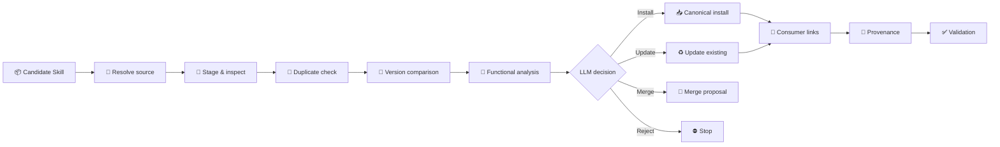
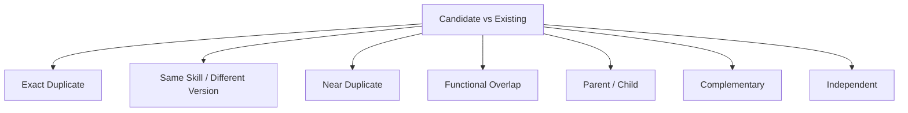
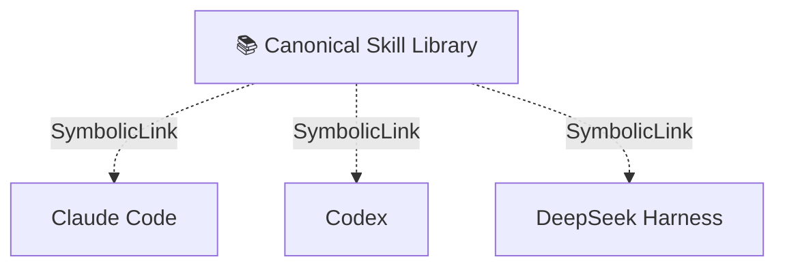

<p align="center">
  
</p>

<div align="center">

# 🧩 skill-install-workflow

**Govern AI Skills before they govern your agents.**

[](#)
[](#)
[](#)
[](#)
[](#)

**English** · [简体中文](./README.zh-CN.md)

</div>

---

## 🌱 Why?

Installing an AI Skill looks simple:

```text
Download → Copy → Done
```

Until your local environment becomes:

```text
~/.claude/skills/
~/.codex/skills/
~/.agents/skills/
~/.cc-switch/skills/

skill-a
skill-a-new
skill-a-v2
another-skill-doing-the-same-thing
...
```

Then the real questions begin:

> Which copy is the real one?  
> Which version is better?  
> Is this capability already installed under another name?  
> Will an update overwrite local changes?

`skill-install-workflow` turns Skill installation from a file-copy operation into a **governed lifecycle decision**.

## 🧠 Core idea

> **LLM decides. Deterministic tools execute. Validation verifies.**



## 🎯 Explicit decisions

| Decision | Meaning |
|---|---|
| `INSTALL_NEW` | Install a genuinely new Skill |
| `DO_NOT_INSTALL` | Existing capability already covers it |
| `UPDATE_EXISTING` | Candidate is a better version |
| `MERGE_INTO_EXISTING` | Absorb useful capabilities without adding another Skill |
| `KEEP_SEPARATE` | Similar domain, different responsibility |
| `REJECT_INVALID` | Incomplete or malformed Skill |
| `REJECT_HIGH_RISK` | Risk exceeds the accepted boundary |
| `SOURCE_VERIFICATION_REQUIRED` | Upstream provenance is uncertain |

## 🔬 More than filename matching

The workflow compares:

```text
purpose
trigger
workflow
inputs / outputs
tools
permissions
safety boundaries
scripts / references
upstream provenance
```

and distinguishes:



## 🏗 Recommended architecture



The goal is:

```text
one Skill
+ one canonical source
+ one provenance record
+ multiple Agent consumers
```

## 🔗 Provenance matters

A GitHub-installed Skill should remain traceable:

```yaml
name: example-skill
repository: owner/repository
branch: main
skill_subpath: skills/example-skill
installed_commit: abc123
content_hash: ...
local_modified: false
```

That makes future updates, rollback and auditing reproducible.

## 🛡 Safety gate

A new independent low-risk Skill should install without redundant confirmation. Approval is required when an operation would:

- replace an existing Skill;
- merge workflows;
- overwrite local modifications;
- introduce high-risk behavior;
- rely on an unverified source.

## 💬 Intended experience

```text
User:
Install this Skill:
https://github.com/example/example-skill

Agent:
Decision: UPDATE_EXISTING

Existing:  example-skill @ abc123
Candidate: example-skill @ def456

Why:
- more precise trigger
- existing safety boundary retained
- no local modifications detected

Approval required because this replaces the canonical version.
```

## 🤝 Designed for

- Claude Code
- OpenAI Codex
- DeepSeek Harness
- CC Switch
- local multi-agent Skill environments

## 🧭 Philosophy

> **Skill installation is not a file-copy operation. It is a lifecycle decision.**
