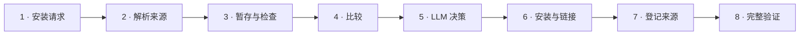
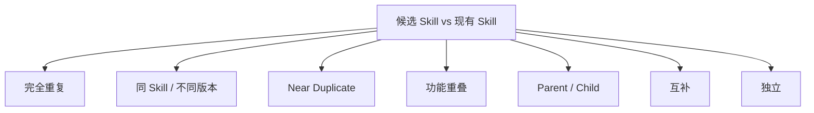
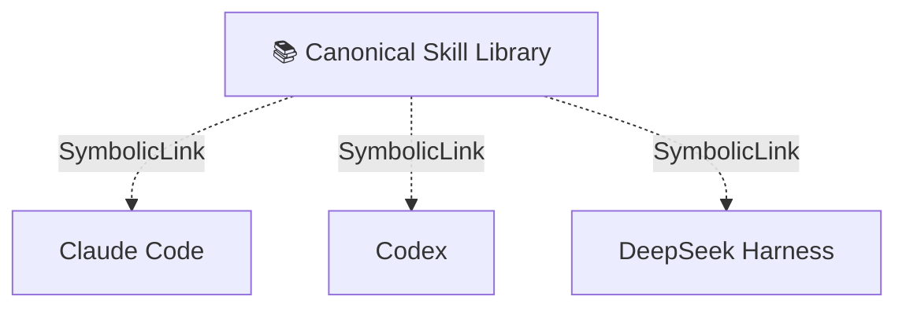

<p align="center">
  
</p>

<div align="center">

[](#)
[](#)
[](#)
[](#)
[](#)

[English](./README.md) · **简体中文**

</div>

---

## 📌 概述

随着本地 AI Agent 生态不断扩展，同一个 Skill 很容易被重复安装、分叉成多个版本、失去 GitHub 来源，或者与另一个不同名称的 Skill 出现功能重叠。

`skill-install-workflow` 把 Skill 安装变成一条可治理的生命周期：

> **识别 → 比较 → 决策 → 安装 → 链接 → 登记 → 验证**

目标不是让 Skill 越多越好，而是让整个 Skill 生态保持**干净、可追溯、可维护、可复现**。

## 🔄 工作流程



### 三层职责

| 层级 | 职责 |
|---|---|
| 🧠 **LLM** | 理解用途、版本差异、功能重叠与风险 |
| ⚙️ **工作流 / 脚本** | 执行确定性的安装、链接和元数据操作 |
| ✅ **验证** | 检查 canonical、Hash、链接和 provenance |

## 🧭 决策模型

| Decision | 含义 |
|---|---|
| 🟢 `INSTALL_NEW` | 安装真正新的 Skill |
| 🔴 `DO_NOT_INSTALL` | 已有能力覆盖，不重复安装 |
| 🔵 `UPDATE_EXISTING` | 候选版本更适合作为主版本 |
| 🟣 `MERGE_INTO_EXISTING` | 吸收有效能力，不新增重复 Skill |
| 🟡 `KEEP_SEPARATE` | 领域相近，但职责不同 |
| ⛔ `REJECT_INVALID` | Skill 残缺或结构无效 |
| 🛡️ `REJECT_HIGH_RISK` | 风险超过可接受边界 |
| 🔎 `SOURCE_VERIFICATION_REQUIRED` | upstream 来源需要进一步确认 |

## 🔬 真正比较的是什么？

这个工作流不会只根据文件夹名、Hash 或时间戳做判断。

它会实际比较：

```text
用途
trigger
workflow
输入 / 输出
工具
权限
安全边界
scripts / references
upstream provenance
本地修改
```

并区分：



## ✨ 核心特性

- 🔁 完全重复检测
- 🧬 多版本语义比较
- 🧠 功能重叠判断
- 🛡 风险门控
- 🔗 适配 SymbolicLink 的多 Agent 共享
- 🧾 Git provenance 追踪
- ✅ 安装后完整性验证

## 📦 安装

`skill-install-workflow` 本质上是一个 AI Agent Skill。即使不使用 CC Switch，也可以直接安装到当前 Agent 使用的 Skill 目录中。

### 方式 A — 不使用 CC Switch，直接安装

只需要选择你实际使用的 Agent。下面给出常见用户级 Skill 目录的安装命令。

#### Claude Code

**macOS / Linux**

```bash
mkdir -p ~/.claude/skills
git clone https://github.com/apexpeng/skill-install-workflow.git \
  ~/.claude/skills/skill-install-workflow
```

**Windows PowerShell**

```powershell
$target = Join-Path $HOME ".claude/skills/skill-install-workflow"
New-Item -ItemType Directory -Force (Split-Path $target -Parent) | Out-Null
git clone https://github.com/apexpeng/skill-install-workflow.git $target
```

#### OpenAI Codex

**macOS / Linux**

```bash
mkdir -p ~/.codex/skills
git clone https://github.com/apexpeng/skill-install-workflow.git \
  ~/.codex/skills/skill-install-workflow
```

**Windows PowerShell**

```powershell
$target = Join-Path $HOME ".codex/skills/skill-install-workflow"
New-Item -ItemType Directory -Force (Split-Path $target -Parent) | Out-Null
git clone https://github.com/apexpeng/skill-install-workflow.git $target
```

#### DeepSeek Harness / shared Agent Skill 目录

**macOS / Linux**

```bash
mkdir -p ~/.agents/skills
git clone https://github.com/apexpeng/skill-install-workflow.git \
  ~/.agents/skills/skill-install-workflow
```

**Windows PowerShell**

```powershell
$target = Join-Path $HOME ".agents/skills/skill-install-workflow"
New-Item -ItemType Directory -Force (Split-Path $target -Parent) | Out-Null
git clone https://github.com/apexpeng/skill-install-workflow.git $target
```

> 如果你的 Agent 使用自定义 Skill 目录，请安装到实际配置的目录，而不是机械照搬上述路径。

### 方式 B — 多 Agent 环境推荐：使用 CC Switch 统一管理

直接安装对于单一 Agent 完全可行。只有当你在同一台电脑上同时使用 Claude Code、Codex、DeepSeek Harness 等多个 Agent 时，分别维护多份实体 Skill 才容易产生重复、版本漂移和更新不同步。

因此本项目推荐在**多 Agent 环境**中使用 CC Switch 作为统一 Skill 管理层：

```text
GitHub Skill
    ↓
CC Switch managed storage
~/.cc-switch/skills/<skill>
    ↓
逐 Skill SymbolicLink
    ├── ~/.claude/skills/<skill>
    ├── ~/.codex/skills/<skill>
    └── ~/.agents/skills/<skill>
```

推荐 CC Switch 设置：

```text
Skills 存储位置：CC Switch
同步方式：SymbolicLink（软链接）
```

这样得到的是：

```text
一个 canonical Skill 实体
+ 一份 provenance
+ 多个 Agent consumer
```

而不是多个彼此独立的实体副本。

使用 CC Switch Deep Link 导入本 Skill：

**Windows PowerShell**

```powershell
Start-Process "ccswitch://v1/import?resource=skill&name=skill-install-workflow&repo=apexpeng/skill-install-workflow&branch=main"
```

**macOS**

```bash
open "ccswitch://v1/import?resource=skill&name=skill-install-workflow&repo=apexpeng/skill-install-workflow&branch=main"
```

也可以直接打开：

```text
ccswitch://v1/import?resource=skill&name=skill-install-workflow&repo=apexpeng/skill-install-workflow&branch=main
```

导入后，在 **CC Switch → Skills** 中选择需要使用该 Skill 的 Agent，并保持 **SymbolicLink** 作为同步方式。

> CC Switch 是多 Agent 集中管理的推荐方案，但**不是普通 Skill 安装的前置条件**。

### 三个 Skill 的推荐安装顺序

如果计划同时使用这三个仓库，推荐按以下顺序安装：

```text
1. skill-install-workflow
        ↓
2. r-data-lineage-plotting
        ↓
3. write-human-r-code
```

推荐理由：

1. **先安装 `skill-install-workflow`**：先建立后续 Skill 的审查、去重、版本判断、安装、来源登记与验证治理入口。
2. **再安装 `r-data-lineage-plotting`**：先建立科研 R 项目的数据血缘、目录职责与可复现性基础。
3. **最后安装 `write-human-r-code`**：在数据血缘基础上进一步约束 R 代码的可读性、科研透明性和重构方式；当任务涉及数据文件或分析对象时，它会与 `r-data-lineage-plotting` 配合使用。

## 🏗 推荐架构



目标不是维护多份实体副本，而是：

```text
一个 Skill
+ 一个 canonical source
+ 一份 provenance
+ 多个 Agent consumer
```

## 🧾 来源追踪

GitHub Skill 应持续保留来源信息：

```yaml
name: example-skill
repository: owner/repository
branch: main
skill_subpath: skills/example-skill
installed_commit: abc123
content_hash: ...
local_modified: false
```

这样未来才能可靠完成更新检查、回滚和审计。

## 🛡 安全与审批边界

用户明确说“安装这个 Skill”时，对于**新、独立、低风险** Skill，不需要反复确认。

只有以下情况进入人工审批：

- 替换已有 canonical Skill；
- 合并两个 Skill；
- 可能覆盖本地修改；
- 高风险 Skill；
- upstream 来源无法可靠确认。

## 💬 理想交互

```text
用户：
安装这个 Skill：
https://github.com/example/example-skill

AI：
Decision: UPDATE_EXISTING

已有版本：abc123
候选版本：def456

模型判断：
- trigger 更准确
- 旧版安全边界得到保留
- 未检测到本地修改

由于需要替换已有 canonical Skill，等待批准。
```

## 🤝 面向

Claude Code · OpenAI Codex · DeepSeek Harness · CC Switch · 本地多 Agent Skill 环境

---

> **Skill 安装不是一次文件复制，而是一项生命周期决策。**
