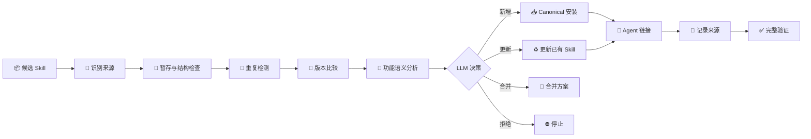
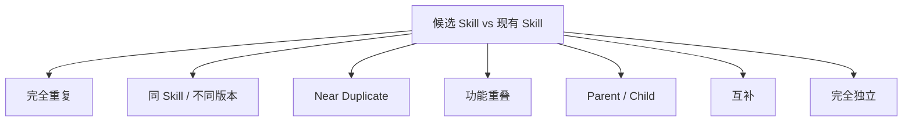
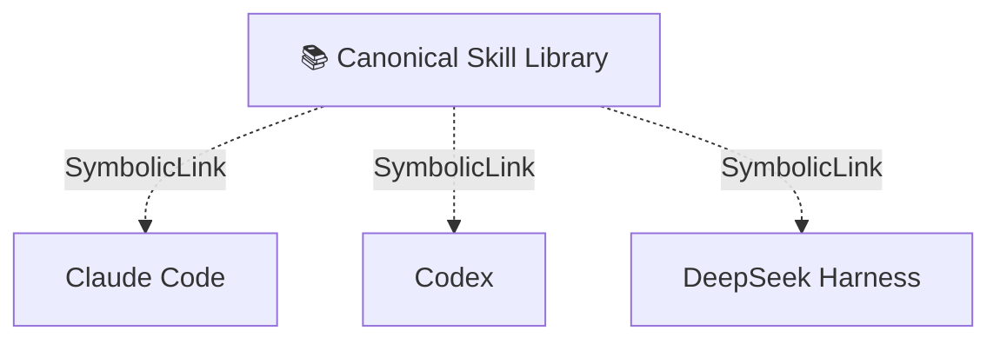

<p align="center">
  
</p>

<div align="center">

# 🧩 skill-install-workflow

**在 Skill 管理 Agent 之前，先管理好 Skill。**

[](#)
[](#)
[](#)
[](#)

[English](./README.md) · **简体中文**

</div>

---

## 🌱 为什么需要它？

AI Skill 最开始的安装通常很简单：

```text
下载 → 复制 → 完成
```

但随着 Claude Code、Codex、DeepSeek Harness 等工具同时使用，目录很容易变成：

```text
~/.claude/skills/
~/.codex/skills/
~/.agents/skills/
~/.cc-switch/skills/

skill-a
skill-a-new
skill-a-v2
另一个功能几乎相同的 skill
...
```

真正棘手的问题随之出现：

> 到底哪一个才是正式版本？  
> 更新时间新的版本就一定更好吗？  
> 新 Skill 是否已经被现有 Skill 覆盖？  
> GitHub 更新会不会覆盖本地修改？

`skill-install-workflow` 的目标，是把 Skill 安装从简单文件操作升级为**可判断、可追踪、可验证的生命周期治理流程**。

## 🧠 核心理念

> **大语言模型负责判断，确定性工具负责执行，验证机制负责验收。**



## 🎯 模型需要真正做决定

| Decision | 含义 |
|---|---|
| `INSTALL_NEW` | 安装新的独立 Skill |
| `DO_NOT_INSTALL` | 已有能力覆盖，不重复安装 |
| `UPDATE_EXISTING` | 升级已有 Skill |
| `MERGE_INTO_EXISTING` | 吸收有效能力，不新增重复 Skill |
| `KEEP_SEPARATE` | 相似但职责不同，保持独立 |
| `REJECT_INVALID` | Skill 结构无效或残缺 |
| `REJECT_HIGH_RISK` | 风险超过可接受边界 |
| `SOURCE_VERIFICATION_REQUIRED` | upstream 来源需要进一步确认 |

## 🔬 不只是比较文件名

真正需要理解的是：

```text
用途
trigger
workflow
输入 / 输出
工具
权限
安全边界
scripts / references
Git upstream
```

并区分：



## 🏗 推荐架构



目标不是：

```text
同一个 Skill
× 三个实体副本
× 多个不同版本
```

而是：

```text
一个 Skill
+ 一个 canonical source
+ 一份 provenance
+ 多个 Agent 共享
```

## 🔗 Skill 也需要“来源血缘”

GitHub Skill 最好能够持续回答：

> 它来自哪里？  
> 当前安装的是哪个 commit？  
> 是否存在本地修改？  
> upstream 是否已经更新？

例如：

```yaml
name: example-skill
repository: owner/repository
branch: main
skill_subpath: skills/example-skill
installed_commit: abc123
content_hash: ...
local_modified: false
```

## 🛡 什么情况下需要人工确认？

对于：

```text
新 Skill + 无冲突 + 无重复 + 低风险
```

用户已经明确说“安装”时，不需要再次确认。

只有涉及：

- 覆盖已有 Skill；
- 合并 Skill；
- 丢失本地修改；
- 高风险行为；
- upstream 来源不明确；

才进入人工审批。

## 💬 理想交互

```text
用户：
安装这个 Skill：
https://github.com/example/example-skill

AI：
Decision: UPDATE_EXISTING

已有版本：abc123
候选版本：def456

模型判断：
- trigger 更准确
- 旧版安全边界得到保留
- 未检测到本地修改

由于需要替换已有 canonical Skill，等待批准。
```

## 🤝 面向

- Claude Code
- OpenAI Codex
- DeepSeek Harness
- CC Switch
- 本地多 Agent Skill 管理

## 🧭 理念

> **Skill 安装不是一次文件复制，而是一项生命周期决策。**
